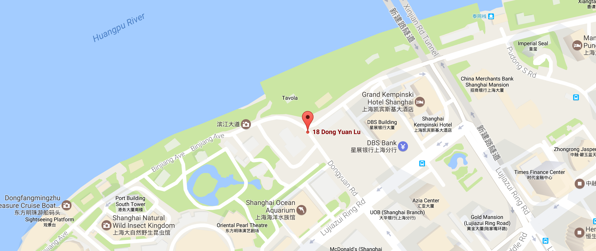

# 2017年第一届ETC黑客马拉松

## 上海 - 50 小时 - 100+ 参赛者

### 精彩待你发现...

[ftconnect.org](http://ftconnect.org/html/index.html)

[etcathon.org](http://etcathon.org/)

## 主办方

[**Ethereum Classic Consortium(ECC) 以太坊原链协会**](http://www.etc.tm/)

## Etcathon 是啥？

Etcathon 是黑客马拉松系列FinTech Connect的首届活动，是国内
首个将金融机构的实战需求与新兴科技区块链连接起来的黑客马拉松活
动，是金融领域新兴科技的秀场，也是金融机构科技创新的实验田。

## Etcathon 为啥？

科技的进步最终目的是为了增加人类的整体福利；我们认为，区块链技
术给我们带来不止是科技的迭代进步，可能是人类通向未来的普罗米修斯
火种。Etcathon 只希望成为火种！

## Etcathon 有啥？

### 宣传大使 美女主持 免费英国10天行 区块链导师 顶级赞助商 全球社区连线 重量级演讲嘉宾 更多待你发现...

您拥有50小时从头开始构建区块链产品，与
100多名其他参与者，争夺属于
你团队的荣誉：

- 状元: 10天英国行
- 探花: 元界特别奖
- 榜眼: ￥5000

写代码，遇见你的知友，享受你的Tea！
<> 欢迎任何开发者</>

## <虚拟营> 支持  
[Ether.camp](https://etc.ether.camp/)

## Philip McMaster(DaLong) Etcathon形象大使

Etcathon不止是黑客马拉松

我们赞美正义，善良的价值观

DaLong与以太坊原链协会ECC一起
传播联合国可持续发展目标

SDG-Sustainable Development Goals

**赞助商SPONSORS**
没有他们，这一切不可能发生！

- 维优元界|
- 比特时代BTC38|
- 雷盈金融科技| 
- CCEG区块链实验室|
- DCG数字货币集团|
- 杭州复杂美科技|

**演讲嘉宾** (排名不分先后)

- 韩锋 DACA秘书长
- Matt Mazur ECIP-1017的作者 
- 范磊博士 上海交通大学 副教授 
- 郭宏才 比特币天使投资人

**导师团** (排名不分先后)

- Maryam Taghiyeva CCEG高级发展分析师 
- 朗豫 巴比特CTO 
- 初夏虎 维优CEO 
- 董元林 雷盈科技技术总监 
- David Johnston Factom 董事长

**评委团** (排名不分先后)

- 初夏虎 维优CEO 
- 黄天威 比特时代 CEO 
- Maryam Taghiyeva 
- CCEG高级发展分析师 
- 吴思进 复杂美科技CEO 
- 沈陶磊 雷盈金融科技CEO

## 指导单位
### 陆家嘴金融区块链联盟

## 承办单位

- [BITKIO比齐奥科技](http://bitkio.com/)|
- [ETCWin-币盈网](https://www.etcwin.com/)|
- 专逸科技|

## 独家媒体主持
巴比特8BTC

## 合作媒体及社区
- 陆家嘴金融网
- 小麦直播
- ETC国际社区BTC
- sosobtc
- BTC Media
- ETCFans
- ETC.today
- ETC.TM
- ETCChina.io

## 协办单位

- [漕河泾创业中心](http://www.caohejingibi.com/zh-cn/)
- [现金巴士](http://www.cashbus.com/)
- [etcchain](http://etcchain.com/)
- [DACA](http://www.daca.asia/)
- [Dianrong](https://www.dianrong.com)
- [ether.camp](https://hack.ether.camp/)
- Fintech Salon丰钛沙龙
- [Gingkoo](http://www.gingkoo.com)
- 上海丰钛信息科技有限公司
- Tecent Public Space (Shanghai)
- [中南资本SegmentFault](http://www.zhongnangroup.cn/)
- Fundonomy

## 活动说明
**团队**

主办机构与赞助商将共同负责提名或选择团队， 每个小组将由3
到5名成员组成，他们可能是参与者，导师或赞助商合作伙伴。
在初始阶段，2月24日前，赞助商可以提名一个（或两个）团
队。 我们预计限制16个小组，如果没有达到16支队伍的限制，
将考虑由ECC提名的额外队伍。 没有预设组团的参与者可以在现
场进行自由组队，最终竞争小组名单将于2017年2月25日公
布。Ether.Camp将为参赛队伍提供网上预演。

**数据源**
主办方ECC提供的数据源，团队可以使用他们可能提前准备的其
他数据源。这些附加数据源应具有普适性，可以是其它项目区块
链(如比特币)公开的数据源。

**产品原型**

参赛者经过3天的开发，最后的产品原型可以为一套数据系统，
具体应用，能够实现方案提出时的全部或部分功能。
获胜者和赞助商将在全球加密社区展示他们的原型。

**评委小组**

独立的评委小组将根据相关评判标准负责评估竞争团队开发的原
型产品，其成员主要来自国内外加密货币社区和金融领域。

## Etcathon黑客马拉松日程安排

### February 24th

- **18:00 - 18:30** 签到时间
- **18:30 - 19:00** 主持开场、破冰
- **19:00 - 19:30** 赞助商需求Post
- **19:30 - 20:30** 方案Pitch
- **20:30 - 21:00** 组队Team

### February 25th
- **09:30 - 10:30** 嘉宾演讲
- **10:30 - 12:00** 导师选定指导团队，确定项目方向
- **12:00 - 13:00** 午餐 
- **13:00 - 18:30** 团队头脑风暴、商业画布及进入开发阶段
- **18:30 - 19:30** 晚餐
- **19:30 - 22:00** 产品原型开发

### February 26th

- **09:30 - 11:30** 产品原型开发
- **11:30 - 12:30** 导师分组指导
- **12:30 - 13:30** 午餐
- **14:00 - 17:00** 项目路演

## 时间

2017年2月24号-26号 

## 地点

中国上海陆家嘴东园路18号  中国金融信息中心

